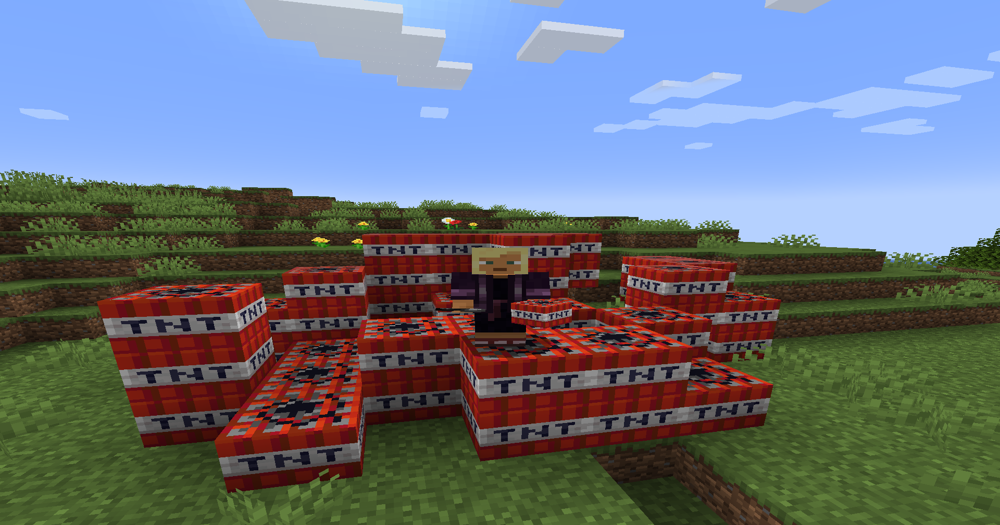
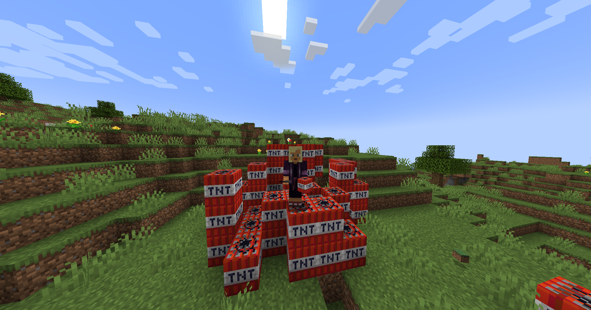
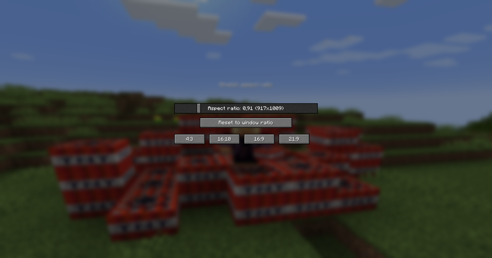

# Мод для изменения ширины экрана

Мод позваляет растягивать или сужать экран (менять соотношения сторон).

## Скриншоты

### Расширение

### Сужение

### Меню настроек
Простой и понятный интерфейс.

## Установка

Мод работает на **Fabric 1.21.1**.
Просто поместите файл мода в папку `mods` и установите `Fabric API`!
